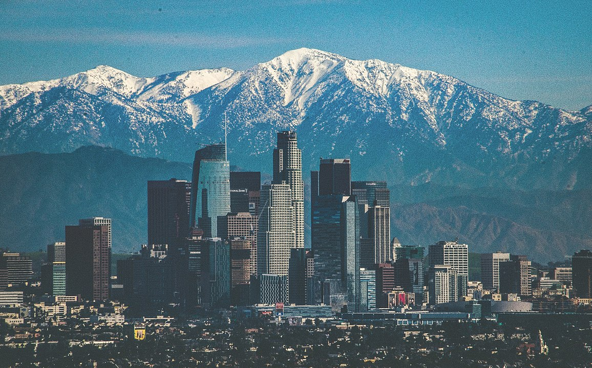

# Los Angeles Neighborhood Analysis

This is a part of the Capstone Project for [IBM Data Science Professional Certificate on Coursera](https://www.coursera.org/professional-certificates/ibm-data-science) 

*Los Angeles Sky Line (Image Source: [Wikipidea](https://en.wikipedia.org/wiki/List_of_tallest_buildings_in_Los_Angeles#/media/File:Los_Angeles,_Winter_2016.jpg))*

My article on [Medium](https://medium.com/@chaitanya_kasaraneni/los-angeles-neighborhood-analysis-c43457441869)

***Note:*** *GitHub doesn't show folium maps. To view maps please go to https://nbviewer.jupyter.org*

## Introduction

Los Angeles is a very vibrant city with a lot of neighborhoods, each with unique character. Some neighborhoods are quiet and cozy, has convenient store locations, while others offer a lot of fun and nightlife activities. Choosing a neighborhood to live in or open a business can be a complicated task to do, but with the help of location data from Foursquare and crime data, we can make it a little bit easier.

### Business Problem
The objective of this capstone project is to analyze and select the best locations in the city of Los Angeles, California to choose a neighborhood to live in or open a new business. Using data science methodology and machine learning techniques like clustering, this project aims to provide solutions to answer the business question: In the city of Los Angeles, California, what would be a better place to live in or start a business?

### Target Audience
- People interested in moving to Los Angeles and looking for a perfect neighborhood for their needs
- Business owners looking to expand their business to a new location
- A beginner data scientist who may use this research as an example

## Data

For this project, the following data is needed:
•	List of neighborhoods in Los Angeles
•	Latitude and longitude coordinates of neighborhoods to get the venue data
•	Crime data in Los Angeles
•	Venues Details

### Data Sources:

1.	**Location Data**
    - First, we need to get a full list of all LA neighborhoods. Wikipedia article [List of districts and neighborhoods in Los Angeles](https://en.wikipedia.org/wiki/List_of_districts_and_neighborhoods_in_Los_Angeles) is a great place to start.
    - [BeautifulSoup](https://www.crummy.com/software/BeautifulSoup/bs4/doc/) is a Python library used for pulling data out of HTML. We will use it to parse the Wikipedia page
    - For geolocation data, we will use the Geocoding API. To get more information about it, follow the Geocoding Developer Guide.
 
 
2.	**Venues Data (Foursquare API)**
    - [Foursquare API](https://foursquare.com/) provides information about venues and geolocation. We will use Foursquare API to get the venue data for LA neighborhoods. Foursquare has one of the largest databases of 105+ million places and is used by over 125,000 developers. Foursquare API will provide many categories of the venue data such as name, location, hours, rating, prices, etc.
    
    
3.	**Crime Data**
    - To analyze criminal activity for each neighborhood we use Los Angeles Crime & Arrest Data: from Beginning 2020 to Present dataset from https://data.lacity.org/A-Safe-City/Crime-Data-from-2020-to-Present/2nrs-mtv8. It contains information about location, time, category and other miscellaneous data from the LA Police Department.   

